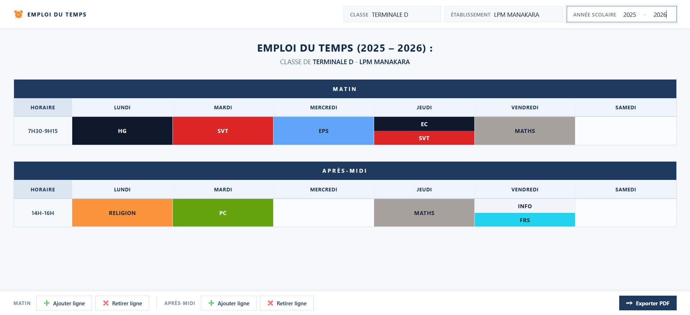

# 🕰️ Emploi du Temps (EDT)

Une application web interactive permettant de concevoir, personnaliser et exporter un emploi du temps scolaire hebdomadaire.

---

## Fonctionnalités principales

- **Gestion des métadonnées** : Personnalisation dynamique de la classe, du nom de l'établissement et de l'année scolaire.
- **Organisation par périodes** : Grilles distinctes pour les créneaux du matin et de l'après-midi avec gestion horaire personnalisable.
- **Gestion dynamique des créneaux** : Ajout et suppression de lignes de cours à la volée via la barre de commandes inférieure.
- **Édition multi-matières** : Possibilité d'intégrer plusieurs cours au sein d'une même plage horaire via une fenêtre modale d'édition.
- **Personnalisation visuelle** :
  - Attribution de couleurs aux cours depuis une palette dédiée.
  - Propagation automatique de la couleur choisie à toutes les occurrences d'une même matière.
  - Calcul automatique du contraste (texte clair ou sombre) pour garantir la lisibilité.
- **Sauvegarde automatique** : Persistance locale des données et du nuancier via le `localStorage` du navigateur.
- **Export et impression** : Génération d'une mise en page au format A4 paysage optimisée pour la sortie PDF.

---

## 📸 Captures d'écran

| Écran                                          | Description |
| ---------------------------------------------- | ----------- |
|  | Page d'EDT  |

---

## Structure du projet

```text
EDT/
├── images/           # Assets graphiques (icônes d'action et visuels)
├── edt.css           # Définition des styles, du thème et du layout d'impression
├── edt.js            # Moteur applicatif, gestion du stockage et export PDF
├── favicon.png       # Icône d'onglet du navigateur
└── index.html        # Structure de l'interface utilisateur
```

---
